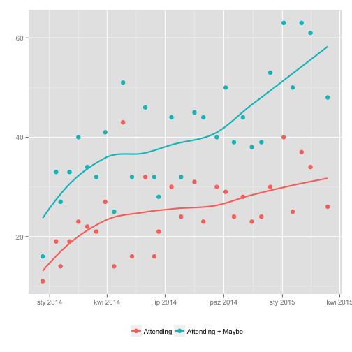

# Facebook event analytics

`stats.rb` fetches all events created by you and creates TSV (tab separated values) file with event dates, number of attending, maybe and invited persons. This allows you to have big picture of how your regular event is doing.

## Requirements

* Ruby 2.0+
* R

## Usage

You need to get token from https://developers.facebook.com/tools/explorer/, `user_events` permission is required.

```shell
$ git clone https://github.com/kfigiela/fb_event_analytics
$ cd ./fb_event_analytics
$ bundle install
$ export FB_TOKEN=<paste token here>
$ ./stats.rb <optional, phrase or regexp that event name will be filtered with> > out.tsv
$ ./plot.r out.tsv # saves out.tsv.pdf plot
```

## Example

